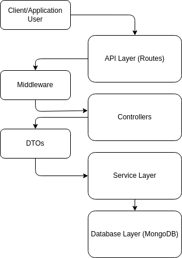

# User Micro Service

[](LICENSE)
[](https://github.com/YourUsername/SecureWebBankingApp)
[](CONTRIBUTING.md)  
[](https://nodejs.org/en/)
[](https://www.typescriptlang.org/)
[](https://expressjs.com/)  
[](https://www.mongodb.com/)
[](https://github.com/sideway/joi)
[](https://mongoosejs.com/)
[](https://github.com/kelektiv/node.bcrypt.js)
[](https://helmetjs.github.io/)
[](https://github.com/expressjs/cors)
[](https://express-validator.github.io/docs/)
[](https://github.com/winstonjs/winston)
[](https://jestjs.io/)
[](https://github.com/visionmedia/supertest)
[](https://github.com/motdotla/dotenv)
[](https://github.com/nfriedly/express-rate-limit)
[](https://github.com/jshttp/http-errors)

## Service Overview

This is a Node.js and TypeScript-based microservice for user registration in a banking application. It provides a RESTful API for creating, retrieving, updating, and deleting user accounts, as well as updating user balances.

## Table of Contents

- [Prerequisites](#prerequisites)
- [Installation](#installation)
  - [Cloning the Repository](#cloning-the-repository)
  - [Installing Dependencies](#installing-dependencies)
- [Configuration](#configuration)
- [Running the Service](#running-the-service)
- [Testing](#testing)
- [API Documentation](#api-documentation)
  - [Endpoints](#endpoints)
    - [Create a User](#create-a-user)
    - [Get All Users](#get-all-users)
    - [Get User by ID](#get-user-by-id)
    - [Update User](#update-user)
    - [Delete User](#delete-user)
    - [Update User Balance](#update-user-balance)
- [Deployment with Docker and Docker Compose](#deployment-with-docker-and-docker-compose)
- [Infrastructure](#infrastructure)
- [Additional Resources](#additional-resources)

## Prerequisites

- **Node.js** (version 14.x or higher)
- **npm** (version 6.x or higher)
- **MongoDB** (running instance)
- **Git** (for cloning the repository)
- **Docker** (optional, for containerization)
- **Docker Compose** (optional, for orchestrating containers)

## Design

<br>

<p align="left">
  
</p>

<br>

## Installation

### Cloning the Repository

```bash
git clone https://github.com/YamtalDev/SecureBankApp.git
cd SecureBankApp/server/user
```

### Installing Dependencies

Install the required npm packages:

```bash
npm install
```

## Configuration

Create a `.env` file in the root directory and add the following environment variables:

```dotenv
NODE_ENV=development
PORT=5000
MONGODB_URI=mongodb://localhost:27017/users
```

- `NODE_ENV`: The environment in which the app is running (e.g., development, production).
- `PORT`: The port on which the server will run. Default is `5000`.
- `MONGODB_URI`: The URI for connecting to MongoDB. Default is `mongodb://localhost:27017/users`.

You can adjust the values as needed for your environment.

## Running the Service

### Starting the Service in Development Mode

To start the service with hot reloading during development:

```bash
npm run dev
```

This script uses `ts-node-dev` to watch for file changes and reload the server automatically.

### Starting the Service in Production Mode

First, build the TypeScript code:

```bash
npm run build
```

Then start the server:

```bash
npm start
```

This compiles the TypeScript code and runs the compiled JavaScript using `node`.

### Starting MongoDB

If MongoDB is not already running on your machine, you can start it using the provided npm script:

```bash
npm run start-mongo
```

**Note:** This script assumes you have MongoDB installed and that you can start it using `sudo systemctl start mongod`. Adjust the script in `package.json` if your setup is different.

## Testing

### Running All Tests

To run all unit and integration tests:

```bash
npm test
```

### Running Unit Tests

```bash
npm run test:unit
```

### Running Integration Tests

```bash
npm run test:integration
```

### Watching Tests

To watch tests and rerun them on code changes:

```bash
npm run test:watch
```

### Generating Test Coverage Report

To generate a test coverage report:

```bash
npm run test:coverage
```

The coverage report will be available in the `coverage` directory.

**Note:** The testing scripts assume that MongoDB can be started and stopped using the provided `start-mongo` and `stop-mongo` scripts. Adjust these scripts if your environment requires different commands.

## API Documentation

The service exposes a RESTful API at `https://localhost:5000/api/users`. All responses are in JSON format.

### Endpoints

#### Create a User

- **URL:** `/api/users`
- **Method:** `POST`
- **Headers:** `Content-Type: application/json`
- **Body:**

  ```json
  {
    "email": "user@example.com",
    "password": "SecurePassword123!",
    "phoneNumber": "+1234567890"
  }
  ```

- **Success Response:**
  - **Code:** `201 Created`
  - **Content:**

    ```json
    {
      "message": "User created successfully.",
      "user": {
        "id": "60f7c0e2b4d3c827d8f0e8b1",
        "email": "user@example.com",
        "phoneNumber": "+1234567890",
        "isVerified": false,
        "balance": 0
      }
    }
    ```

#### Get All Users

- **URL:** `/api/users`
- **Method:** `GET`
- **Success Response:**
  - **Code:** `200 OK`
  - **Content:**

    ```json
    {
      "users": [
        {
          "id": "60f7c0e2b4d3c827d8f0e8b1",
          "email": "user@example.com",
          "phoneNumber": "+1234567890",
          "isVerified": false,
          "balance": 0
        },
        {
          "id": "60f7c1a3b4d3c827d8f0e8b2",
          "email": "anotheruser@example.com",
          "phoneNumber": "+0987654321",
          "isVerified": true,
          "balance": 100
        }
      ]
    }
    ```

#### Get User by ID

- **URL:** `/api/users/:id`
- **Method:** `GET`
- **URL Params:**
  - `id` - The ID of the user.
- **Success Response:**
  - **Code:** `200 OK`
  - **Content:**

    ```json
    {
      "user": {
        "id": "60f7c0e2b4d3c827d8f0e8b1",
        "email": "user@example.com",
        "phoneNumber": "+1234567890",
        "isVerified": false,
        "balance": 0
      }
    }
    ```

#### Update User

- **URL:** `/api/users/:id`
- **Method:** `PUT`
- **Headers:** `Content-Type: application/json`
- **URL Params:**
  - `id` - The ID of the user.
- **Body:** (Include only the fields you wish to update)

  ```json
  {
    "email": "newemail@example.com",
    "password": "NewSecurePassword456!",
    "phoneNumber": "+1122334455"
  }
  ```

- **Success Response:**
  - **Code:** `200 OK`
  - **Content:**

    ```json
    {
      "message": "User updated successfully.",
      "user": {
        "id": "60f7c0e2b4d3c827d8f0e8b1",
        "email": "newemail@example.com",
        "phoneNumber": "+1122334455",
        "isVerified": false,
        "balance": 0
      }
    }
    ```

#### Delete User

- **URL:** `/api/users/:id`
- **Method:** `DELETE`
- **URL Params:**
  - `id` - The ID of the user.
- **Success Response:**
  - **Code:** `200 OK`
  - **Content:**

    ```json
    {
      "message": "User deleted successfully."
    }
    ```

#### Update User Balance

- **URL:** `/api/users/:id`
- **Method:** `PATCH`
- **Headers:** `Content-Type: application/json`
- **URL Params:**
  - `id` - The ID of the user.
- **Body:**

  ```json
  {
    "amount": 50
  }
  ```

  - To increase the balance by 50 units.
  - Use a negative number to decrease the balance.

- **Success Response:**
  - **Code:** `200 OK`
  - **Content:**

    ```json
    {
      "message": "Balance updated successfully.",
      "user": {
        "id": "60f7c0e2b4d3c827d8f0e8b1",
        "email": "user@example.com",
        "phoneNumber": "+1234567890",
        "isVerified": false,
        "balance": 50
      }
    }
    ```

## Deployment with Docker and Docker Compose

### Building the Docker Image

Ensure Docker is installed and running on your machine.

1. **Build the Docker image:**

   ```bash
   docker build -t user-service .
   ```

2. **Run the Docker container:**

   ```bash
   docker run -p 5000:5000 --env-file .env user-service
   ```

### Using Docker Compose

A `docker-compose.yml` file is provided to run the service along with a MongoDB instance.

1. **Run Docker Compose:**

   ```bash
   docker-compose up --build
   ```

   This command builds the Docker images and starts the containers.

---

For any questions or support, please contact [tal.aharon.work@gmail.com](mailto:tal.aharon.work@gmail.c).